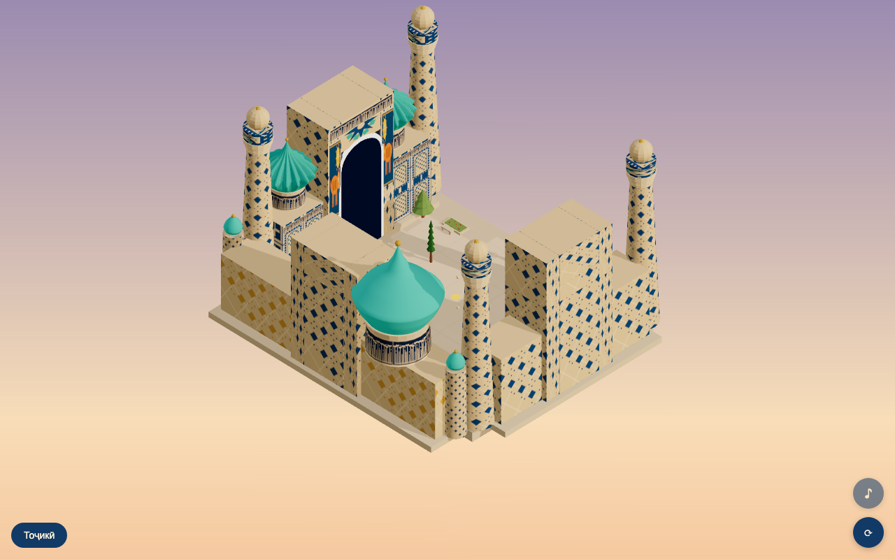

# Registon — Interactive 3D Experience

An interactive, music-video-style 3D experience of the Registan square in Samarkand — available in English and Тоҷикӣ (Tajik). Walk through the plaza in isometric view, rotate the camera, tap hotspots to read architectural lore, and let a generative ambient soundscape set the mood.



## Features

- Isometric Three.js scene with procedural geometry — no external 3D assets
- Three madrasahs (Ulugh Beg, Sher-Dor, Tilya-Kori) with anatomically correct pishtaqs, minarets, and domes
- Procedural majolica tile patterns (girih geometry, muqarnas, tiger spandrels, calligraphy)
- Tap-to-move character with A* pathfinding on the tile grid
- 8 hotspot cards with bilingual (EN / Тоҷикӣ) architectural descriptions
- 90° orbital camera rotation, bloom post-processing, sunset lighting
- Generative ambient audio: detuned drone pad + deterministic pentatonic plucks, no licensing required
- Animated doves, procedural trees, particle leaves
- No-WebGL graceful fallback

## Quickstart

```bash
npm install
npm run dev      # http://localhost:5173
npm test         # vitest unit tests (29 passing)
npm run build    # tsc + vite production build
```

## Tech

- **Three.js r184** — geometry, materials, post-processing (UnrealBloomPass)
- **WebAudio API** — generative engine: 3 detuned oscillators, LFO breathing, pentatonic plucks via golden-angle scheduling
- **TypeScript strict** — full type coverage, no `any`
- **Vite** — dev server + production bundler
- **Vitest** — unit tests for pathfinding, grid, coords, i18n, orbit math, audio determinism
- **Playwright** — E2E screenshot and audio graph verification scripts
- Procedural everything: patterns, geometry, and audio are all generated at runtime

## Credits

Architectural reference photos from [Wikimedia Commons](https://commons.wikimedia.org/) (Creative Commons); used as visual reference only — all geometry is hand-coded. Tiger and calligraphy motifs are stylized interpretations. Tajik translations pending review by a native speaker.

Several modeling techniques (true-arch portal screens, telescoping iwan frames, rope columns, square-kufic frets, per-madrasah tympanum art, hollow courtyards) were adapted from [muqaddaszehni/kijon#1](https://github.com/muqaddaszehni/kijon/pull/1), an earlier procedural Registan study, reworked here for this project's palette, scale, LOD pipeline, and walkable world.
